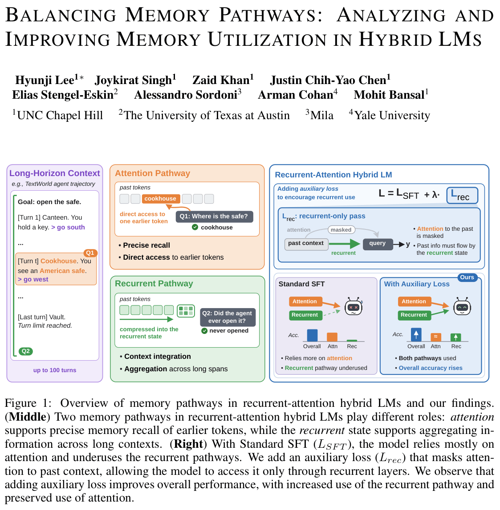

# Balancing Memory Pathways

Code for [*Balancing Memory Pathways: Analyzing and Improving Memory Utilization in Hybrid LMs*](https://arxiv.org/abs/2610.06750).

<p align="center"></p>

Recurrent–attention hybrid LMs carry past information along two pathways: the
**attention** KV cache and the **recurrent state**. We restrict one pathway at a
time, leaving computation inside a segment untouched:

| condition | how | past reachable through |
|---|---|---|
| recurrent-only | attention across segment boundaries is masked | recurrent state |
| attention-only | recurrent state (and short conv) reset at each segment boundary | attention |

To encourage better coordination between the two memory pathways, we add an
auxiliary loss that limits attention's access to earlier context (the
recurrent-only condition) while the recurrent state propagates through the full
sequence. This objective encourages the model to retain and use information through the
recurrent pathway alongside attention.


## Requirements

```
pip install -r requirements.txt
```

## Data

### Question Answering

`make_qa_data.py` downloads the datasets from the Hugging Face Hub and converts
them to the format below.

- [DROP](https://huggingface.co/datasets/ucinlp/drop)
- [HotpotQA](https://huggingface.co/datasets/hotpotqa/hotpot_qa)
- [Qasper](https://huggingface.co/datasets/allenai/qasper)
- [NarrativeQA](https://huggingface.co/datasets/deepmind/narrativeqa)
- [MuSR](https://huggingface.co/datasets/TAUR-Lab/MuSR)
- [MINTEval](https://huggingface.co/datasets/dinobby/MINTEval)

```bash
python make_qa_data.py --out data/qa
```

```json
{"id": "...", "dataset": "qasper", "context": "<document>",
 "question": "<question>\n\nAnswer with a short answer only ...", "answer": "Answer: <gold>",
 "golds": ["<gold>", "<other annotator answers>"], "metric": "f1"}
```

NarrativeQA uses the full story; MuSR lists the answer options in the question.

### Agentic Tasks

| | train | valid | test | step limit |
|---|---|---|---|---|
| TextWorld | Quest, 1,000 games | Quest, 150 | Quest / Treasure, 200 each | 100 |
| BabyAI | MiniBossLevel, 100 | MiniBossLevel, 100 | PutNextLocal / GoToObjMaze, 100 each | level default |

Games are generated from non-overlapping seed ranges (train / valid / test).
TextWorld uses easy Quest presets for training and harder presets for
evaluation, with goal-only objectives (the final condition, not a walkthrough).
BabyAI observations are verbal descriptions of the 7x7 egocentric view; the
prompt never contains any part of the solution.

`make_agent_data.py` writes one gold trajectory per line, as chat messages.

```bash
python make_agent_data.py --env textworld --game quest --split train --n 1000 --out data/textworld/train.jsonl
python make_agent_data.py --env textworld --game quest --split valid --n 150 --out data/textworld/valid.jsonl
python make_agent_data.py --env babyai --game MiniBossLevel --split train --n 100 --out data/babyai/train.jsonl
python make_agent_data.py --env babyai --game MiniBossLevel --split valid --n 100 --out data/babyai/valid.jsonl
```

```json
{"messages": [{"role": "user", "content": "<goal + observation>"},
              {"role": "assistant", "content": "<action>"},
              {"role": "user", "content": "<observation>"}, ...]}
```

## Training

| loss | flag |
|---|---|
| $\mathcal{L}_{\text{SFT}}$ | `--objective sft` |
| $\mathcal{L}_{\text{SFT}} + \lambda\mathcal{L}_{\text{rec}}$ (ours) | `--objective sft+rec` |
| $\mathcal{L}_{\text{rec}}$ | `--objective rec` |
| $\mathcal{L}_{\text{attn}}$ | `--objective attn` |
| $\mathcal{L}_{\text{SFT}} + \lambda\mathcal{L}_{\text{attn}}$ | `--objective sft+attn` |

$\mathcal{L}_{\text{rec}}$ and $\mathcal{L}_{\text{attn}}$ are the SFT loss computed under the
recurrent-only and attention-only conditions; $\lambda$ is `--lam` (default 0.25).

Models: `--model qwen3.5-4b` ([Qwen/Qwen3.5-4B](https://huggingface.co/Qwen/Qwen3.5-4B)) and
`--model nemotron-h-4b` ([nvidia/Nemotron-H-4B-Instruct-128K](https://huggingface.co/nvidia/Nemotron-H-4B-Instruct-128K)).

```bash
python train_aux_loss.py --model qwen3.5-4b --task qa --objective sft+rec \
    --train data/qa/train.jsonl --valid data/qa/valid.jsonl --out ckpt/qa/qwen3.5-4b_sft+rec

python train_aux_loss.py --model nemotron-h-4b --task agentic --objective sft+rec \
    --train data/textworld/train.jsonl --valid data/textworld/valid.jsonl --out ckpt/textworld/nemotron-h-4b_sft+rec
```

## Evaluation

### Question Answering

```bash
python eval_pathways.py --model qwen3.5-4b --ckpt ckpt/qa/qwen3.5-4b_sft+rec/best \
    --data data/qa/test.jsonl --out results/qa.jsonl
python score_qa.py results/qa.jsonl
```

### Agentic

* TextWorld
```bash
python eval_agent.py --env textworld --game treasure --model qwen3.5-4b \
    --ckpt ckpt/textworld/qwen3.5-4b_sft+rec/best --out results/tw_treasure.json
```

* BabyAI
```bash
python eval_agent.py --env babyai --game GoToObjMaze --condition recurrent_only --model qwen3.5-4b \
    --ckpt ckpt/babyai/qwen3.5-4b_sft+rec/best --out results/babyai_maze_rec.json
```


## Citation

```bibtex
@misc{lee2026balancingmemorypathwaysanalyzing,
      title={Balancing Memory Pathways: Analyzing and Improving Memory Utilization in Hybrid LMs},
      author={Hyunji Lee and Joykirat Singh and Zaid Khan and Justin Chih-Yao Chen and Elias Stengel-Eskin and Alessandro Sordoni and Arman Cohan and Mohit Bansal},
      year={2026},
      eprint={2610.06750},
      archivePrefix={arXiv},
      primaryClass={cs.CL},
      url={https://arxiv.org/abs/2610.06750},
}
```
